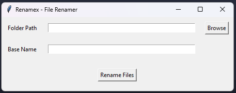

## Renamex - File Renamer
- Rename all files in the same folder
- Will increase the number for each file renamed, like...file1, file2
- Choose the folder path and the base name
- Don't waste time renaming manually each file, do it at once

### Dependencies
- Os
- Tkinter

### Run the app
`python main.py`

### Preview

